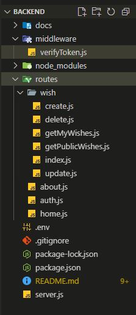
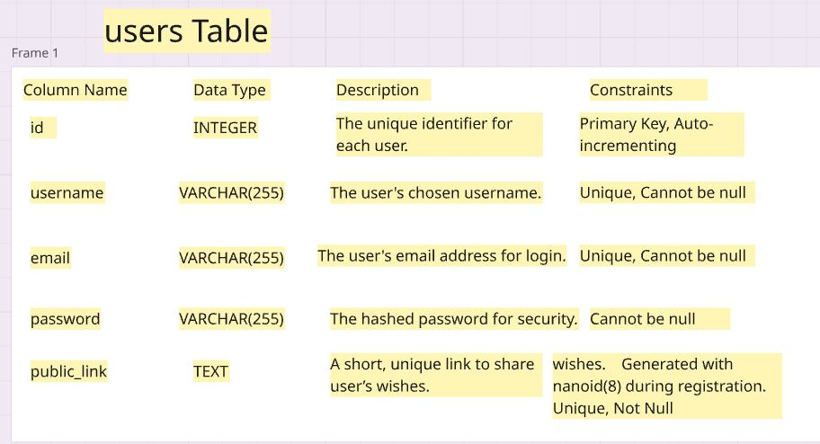
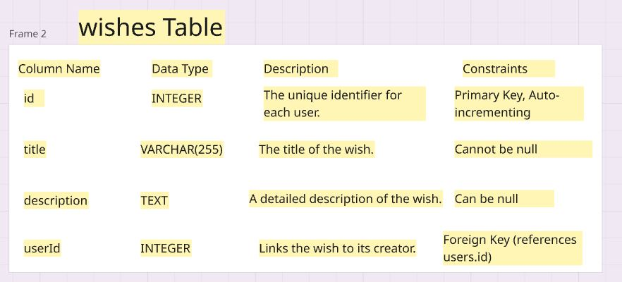
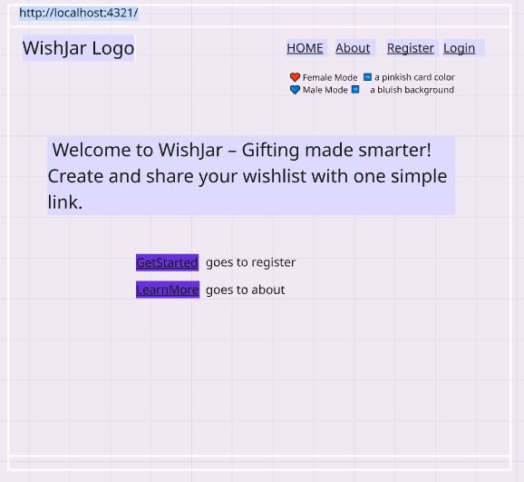
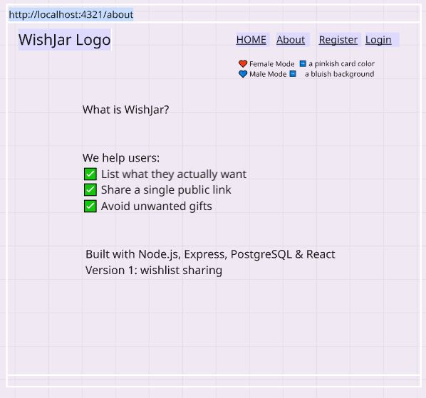
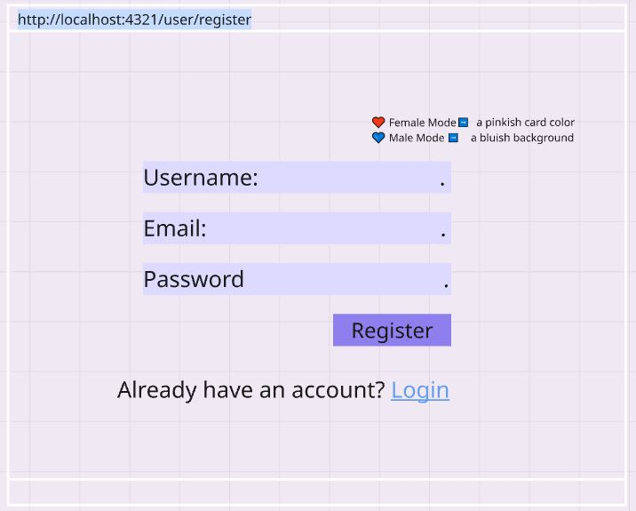
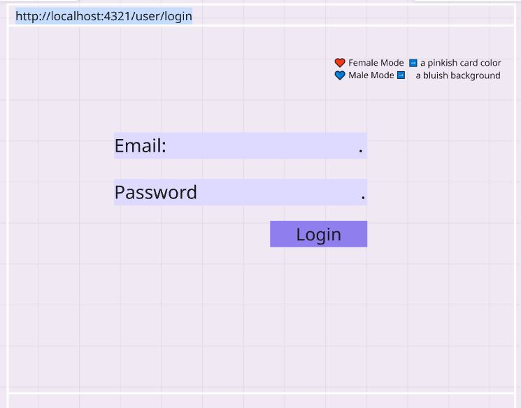
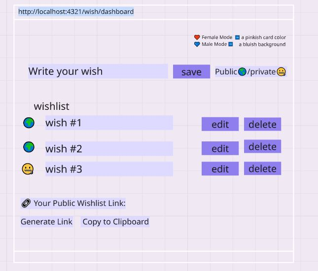
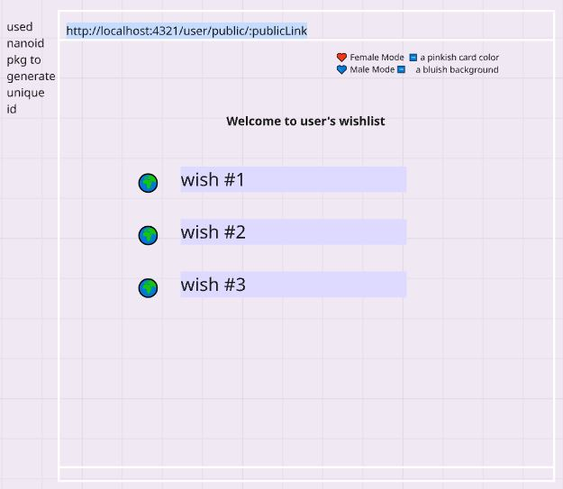

# WishJar
### The Problem:
### We've all been there wanting to gift someone something special, but not knowing what they actually want.It's real life problem we've all faced: What should I get to my friend for their birthdays, weeding or any occasion. You want to gift something meaningful—something they actually want or need but you're stuck guessing and end up giving:
- Unwanted stuff
- Things they’ll never use
- Gifts that stay unopened 
### The Solution:
### WishJar clears the confusion. It lets users create wishlists and share them with a simple public link. No more guessing. No more awkward gifts. Just meaningful gifting easy.

### What is WishJar?

### WishJar is a wishlist sharing app where users can:
- Sign up and log in securely.
- Create public or private wishes.
- Edit/delete a wish eaisly.
- Generate a shareable public link so they can share that link on social media (Instagram bio, WhatsApp, etc.).
- Let others view their wishlist without logging in.

### In version 1, WishJar is a one-way sharing tool no social interaction yet.. It focuses on making gift-giving smarter and more intentional.But future updates may include:
-  Wallet & Group Gifting (Future Feature). 
- AI-powered wish creation.
- Support interactions like wish reservations, comments and likes.

## Stretch Goal 
### Wallet & Group Gifting (Future Feature)
Some wishes go beyond simple gifts — like travel experiences, gadgets, or courses. In future versions, WishJar will introduce:

- **User Wallets:** Each user will have a wallet connected to their wishlist.

- **Contributions:** Friends & family can contribute any amount towards a wish.

- **Group Gifting:** Enables collective contributions for higher-cost wishes like: Travel adventures.
### AI-powered Wish Suggestions
- In upcoming versions, AI will assist users by:
- Helping them describe their wishes in more detail
- Suggesting ideas based on personal interests
- Making wishlists even clearer and easier to understand

### Core Features(v1)

- User Registeration and Login (JWT Auth).
- Wishlist Creation (public/private).
- Edit or delete a Wish.
- Public Link Generation via nanoid.
- PostgreSQL Database integration.

### Backend Structure

### DataBase Tables
### **User Table** it containes 5 different coulumns id, username, email,password and public-link which is generated with nanoid(8) during registration.

### **wish Table** it containes 5 different coulumns  id, title,description, user_id to link each wish with it's creator and is_private boolean to control the privacy of their wishes

### Tech Tools

- Backend: Node.js, Express
- Authentication: JWT, bcrypt
- URL Genration: nanoid
- DataBase: PostgrSQL
- Frontend:React
- Hosting: Render

## WireFrames
### WireFrames creating using Miro and includes:

### **Home Page**  explaining how WishJar works.

### **About Page**  A short message explaining why this app exists and what problem it solves.

### **Register page** Allow users to create an account

### **Login Page** Secure user login to access their wishes.

### **Dashboard** Main control panel for View and manage (adding/updating/deleting wishes)

### **Public wishlist page** A shareable, view-only page visible to others via a unique link for a public wishes.
